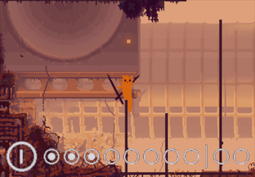

# KarmaAppetite 2.0  
  
  
  
This is a game mod for Rain World: Downpour v1.9 (DLC required).  
  
[RELEASE DOWNLOAD](https://github.com/Dark-Gran/KarmaAppetite2)  
  
Installation:  
- Download KarmaAppetite2.rar and extract it into the "mods" folder.  
- Archive contains 4 mods:  
   - KA_KarmaAppetite (base mod)  
   - KA_SolemnQuarry (region mod - can be used separately, however the Iterator won't be present)  
   - KA_IteratorKit (addition for the region)  
   - SlugBase (dependency)  
- Make sure all four mods are enabled in the Remix menu in game.  
  
  
_If you want to learn about everything I do, I'll be happy if you [follow me on my humble Twitter](https://twitter.com/DarkGran_CZ)._  
  
_You can also [contact me on Discord](https://discordapp.com/users/darkgran) with questions and/or issues._  
  
  
## Description  
  
A witty slugcat with a progressive Karma:Food:Stats system. Also able to craft tools, and even make shortcuts of its own.  
  
**Controls:** Hold Q to craft. Hold E + direction to tunnel. (tapping the direction is enough, no need to hold)  
  
### Features  
- **Karma/Food/Stats scaling:** Higher Karma translates to higher food requirement. However the more food slugcat eats, the stronger it becomes! Affects things like speed, spear power, and lung capacity.  
- **Crafting:** Holding Q while stationary combines - or dismantles - held items. If nothing is held, it will find (create) a piece of rock. See the crafting recipes below.
- **Tunneling:** Holding E will move the slugcat through a temporary shortcut. It provides only a partial invulnerability, so be careful what you tunnel through!  
  
### Crafting recipes   

## Known Issues & TODO list  
  
- Some images lack flatmode version, others exist in flatmode only.  
- Region is rather a mini-region: needs more rooms.  
- Finishing the game without finishing the quest has been cut for now.  
- Player guide needs upgrade.  
- Iterator deserves a prettier halo and a conversation upgrade (eg. comment on delivering more quest items after finishing already).  
- Region music has been cut. (inspiration: [Ghost Cop - Just run](https://www.youtube.com/watch?v=uJRGnA-dSQw))  
  
## Acknowledgements  
  
This mod uses [SlugBase](https://github.com/SlimeCubed/SlugBase) for slugcat's basic framework.  
Special thanks go to [IteratorKit](https://github.com/Twofour2/IteratorKit) for enabling the regions Iterator.  
  
## Source Code  
  
The code of all modules is open-source. Main code is in this repository, however the region and the forked IteratorKit are separated:  
Git Links:  
[KarmaAppetite_SolemnQuarry](https://github.com/Dark-Gran/KarmaAppetite-SolemnQuarry)  
[KarmaAppetite_IteratorKit](https://github.com/Dark-Gran/KarmaAppetite-IteratorKit)  
  
