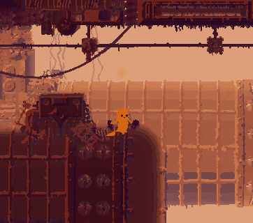
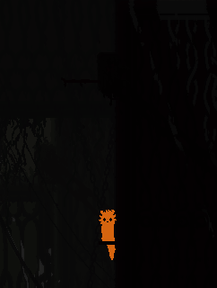

# KarmaAppetite 2.0  
  
  
  
This is a game mod for Rain World: Downpour v1.9 (DLC required).  
Applies to all characters.  
  
[**RELEASE DOWNLOAD**](https://github.com/Dark-Gran/KarmaAppetite2/releases/download/2.0/KarmaAppetite2.rar)  
  
Installation:  
- Download KarmaAppetite2.rar and extract it into the "mods" folder.  
- Archive contains 4 mods:  
   - KA_KarmaAppetite (base mod)  
   - KA_SolemnQuarry (region mod - can be used separately, however the Iterator won't be present)  
   - KA_IteratorKit (addition for the region)  
   - SlugBase (dependency)  
- Make sure all four mods are enabled in the Remix menu in game. (Config menu with cheats available)  
  
Unlike in the [previous version](https://github.com/Dark-Gran/KarmaAppetite), there is no ExtraInventory mod.  
**But if your slugcat really needs a backpack, I can recommend [LeeMoriya's Inventory Mod](https://github.com/LeeMoriya/Inventory).**  
  
**Steam Links:**  
[KA_KarmaAppetite](https://steamcommunity.com/sharedfiles/filedetails/?id=3077237509)  
[KA_IteratorKit](https://steamcommunity.com/sharedfiles/filedetails/?id=3077237785)  
[KA_SolemnQuarry](https://steamcommunity.com/sharedfiles/filedetails/?id=3077239556)  
[SlugBase](https://steamcommunity.com/sharedfiles/filedetails/?id=2933196558)  
  
## Description  
  
A witty slugcat with a progressive Karma:Food:Stats system. Also able to craft tools, and even make shortcuts of its own.  
  
_Applies to all slugcats, however only the Pathfinder gets the "true campaign experience"._
  
**Controls:** Hold Q to craft. Hold E + direction to tunnel. (tapping the direction is enough, no need to hold)  
  
### Features  
- **Karma/Food/Stats scaling:** Higher Karma translates to higher food requirement. However the more food slugcat eats, the stronger it becomes! Affects things like speed, spear power, and lung capacity. Applies to all slugcats.  
- **New Campaign:** New mini-region and new iterator with a new quest! Includes custom pearls. Best played with The Pathfinder.  
- **Crafting:** Holding Q while stationary combines held items. If nothing is held, it will find (create) a piece of rock. Items can also be dismantled (eg. breaking spear in half, or food from a lantern). See the crafting recipes below. 
- **Tunneling:** Holding E will move the slugcat through a temporary shortcut. It provides only a partial invulnerability, so be careful what you tunnel through!  

    

### Power Comparison  
  
This section contains a frame of reference, a comparison to other Slugcats.  
_You may want to find out about Pathfinder's potential in game._  
  

  
  
SPOILER
  
  
  **No food, any Karma**: Slower than Monk and can't even throw a spear properly: stucking it into walls/creatures requires a jump into melee distance.  
  **Max food, Karma 1-3**: +- Survivor  
  **Max food, Karma 5**: Glowing Hunter with a multiplied damage on spear.  
  **Max food, Karma 10**: Dances with Martyr. (on Karma 10, all bonuses are doubled)  
  Note: Karma 7 removes all food prices.  
  Note: Final quest item provides Karma10 bonuses plus something extra.

### Crafting recipes   
  

  

SPOILER
  
  
Items marked * can be reverse-engineered (dismantled), however only one item is received in most cases.  
  
Empty handed => Find Rock  
Rock + Rock => Spear*  
Fireplant + Waternut/Rock => Bomb*  
Spear + Bomb => Explosive Spear*  
Fireplant + Fireplant => Beebomb  
Slime/Jellyfish/Overseer/Neuron/Flashbang + Dangle/Waternut => Lantern*  
Dangle fruit + Vulture worm => Grappleworm*  
Jellyfish + Dangle/Waternut => Flashbang*  
Mushroom + Mushroom => Gasbomb  
Mushroom + Flylure => KarmaFlower  
Neuron + Rock => Overseer  
Overseer + Overseer => Fireplant  
Pearl + Overseer => Neuron  
Neuron/Karma flower + Neuron/Overseer => Singularity bomb (with Highest Karma bonus only)  
  
Creature + Spear/Rock => Killed creature  
Creature + Jellyfish => Killed creature  
  

  
## Known Issues & TODO list  
  
- Some images lack a flatmode version, others exist in flatmode only.  
- Region is rather a mini-region: needs more rooms (draft on paper).  
- Special outro for finishing the game without completing the quest has been cut for now.  
- Player guide needs upgrade of its capabilities.  
- Iterator deserves a prettier halo and a conversation upgrade (eg. proper pearl reading and comments on delivering more quest items after finishing already).  
- Region music has been cut for now. (inspiration: [Ghost Cop - Just run](https://www.youtube.com/watch?v=uJRGnA-dSQw))  
  
## Acknowledgements  
  
This mod uses [SlugBase](https://github.com/SlimeCubed/SlugBase) for slugcat's basic framework.  
Special thanks go to [IteratorKit](https://github.com/Twofour2/IteratorKit) for enabling the regions Iterator!  
  
## Source Code  
  
The code of all modules is open-source. Main code is in this repository, however the region and the forked IteratorKit are separated:  
[KarmaAppetite_SolemnQuarry](https://github.com/Dark-Gran/KarmaAppetite-SolemnQuarry)  
[KarmaAppetite_IteratorKit](https://github.com/Dark-Gran/KarmaAppetite-IteratorKit)  
  
## Contact  
  
_[Contact me on Discord](https://discordapp.com/users/darkgran) with questions and/or issues._  
